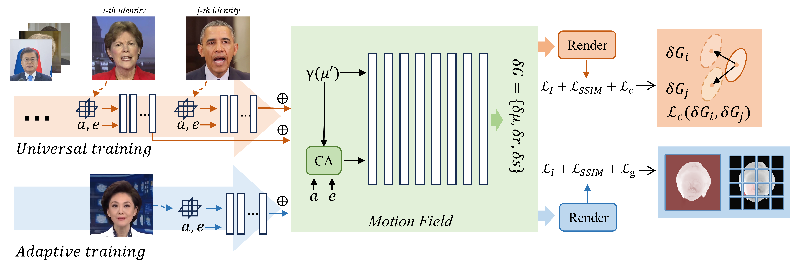

# GSTalk: Few-Shot talking head synthesis based on Gaussian splatting



## Install
```
git submodule update --init --recursive
conda env create --file environment.yml
conda activate instag
pip install "git+https://github.com/facebookresearch/pytorch3d.git"
pip install tensorflow-gpu==2.10.0
```

### Preparation
- Prepare pre-trained weights for the tools and the 3DMM model for head pose estimation.

  ```bash
  bash scripts/prepare.sh
  ```

- Download 3DMM model from [Basel Face Model 2009](https://faces.dmi.unibas.ch/bfm/main.php?nav=1-1-0&id=details):

  ```bash
  # . run following
  cd data_utils/face_tracking
  python convert_BFM.py
  ```

- Prepare the environment for [EasyPortrait](https://github.com/hukenovs/easyportrait):

  ```bash
  # prepare mmcv
  conda activate instag
  pip install -U openmim
  mim install mmcv-full==1.7.1 prettytable
  
  # download model weight
  wget "https://rndml-team-cv.obs.ru-moscow-1.hc.sbercloud.ru/datasets/easyportrait/experiments/models/fpn-fp-512.pth" -O data_utils/easyportrait/fpn-fp-512.pth
  ```

- Prepare the environment for [sapiens](https://github.com/facebookresearch/sapiens/blob/main/lite/README.md):

  ```bash
  conda create -n sapiens_lite python=3.10
  conda activate sapiens_lite
  conda install pytorch==2.2.1 torchvision==0.17.1 torchaudio==2.2.1 pytorch-cuda=12.1 -c pytorch -c nvidia
  pip install opencv-python tqdm json-tricks
  # Download the sapiens models. Git LFS is required. 
  # We defaultly choose 0.3b models here to save storage and time, while 2b is better.
  # For the Chinese Mainland users, may manually choose the HF mirror in the script for acceleration.
  bash scripts/prepare_sapiens.sh
  ```

### Data Preparation
Please refer to [TalkingGaussian](https://github.com/Fictionarry/TalkingGaussian/blob/main/README.md) for preprocessing the dataset.

### Universal Training
Input multiple preprocessed datasets for Universal Training. Please modify the settings for selecting the datasets to be input in pretrain.py.
```bash
bash scripts/pretrain_con.sh data/pretrain output/<project_name> <GPU_ID>
```

### Adaptation

With the new identity dataset, execute the script to train a new person-specific model by building on the pre-training.

```bash
bash scripts/train_xx_few.sh data/<ID> output/<project_name> <GPU_ID>
```

### Inference with Specified Audio
```bash
python synthesize_fuse.py -S data/<ID> -M output/<project_name> --dilate --use_train --audio <preprocessed_audio_feature>.npy --audio_extractor ave
```
